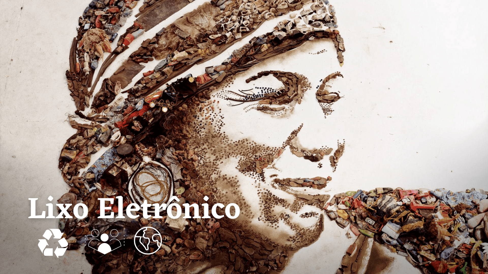

<h1 align="center">
    <br>
    <p align="center">Projeto Final {reprograma}<p>
</h1>
<p align="center">

</p>
<br>

## 👩🏼‍💻 Sobre o projeto 

<br>

<p align="justify">Desenvolvi essa aplicação porque acredito que pequenas revoluções individuais podem mudar o mundo. De acordo com o relatório The Global E-Waste Monitor 2017 da ONU, o Brasil produz em média 1,5 milhão de toneladas de lixo eletrônico por ano. No mundo, foram gerados o equivalente a 4,5 mil Torres  Eiffel de lixo eletrônico (44,7 milhões de toneladas). E até 2021, a previsão é que esse número suba para 52,2 milhões de toneladas por ano.

<p align="justify">Poucas informações são divulgadas sobre pontos de coleta desse tipo de resíduo - que usualmente são descartados junto com o lixo comum. Trago informações sobre pontos de coleta na cidade de João Pessoa-PB. A API busca incentivar o destino ecologicamente correto para o e-lixo, bem como a reciclagem e a conscientização. Espero desencandear uma cadeia de ações. Essa é minha voz.

<br><br>

## ♻️ Lixo Extraordinário: uma API sobre lixo eletrônico

<br>

<p align="justify">O projeto é uma API REST que permite que pessoas cadastrem pontos de coleta de lixo eletrônico, a fim de disseminar informações sobre o assunto.

<p align="justify">A interface é um CRUD completo integrado com o banco de dados, onde é listado os locais de coleta, cadastro de novos endereços, atualização dos dados e deleção de locais que foram inseridos. 
  
<br>

## 🔗 Link 

- [Apresentação](https://www.canva.com/design/DAEyhHUs7PQ/D9gSA-VfzkmT7RgMpg8sHg/view?utm_content=DAEyhHUs7PQ&utm_campaign=designshare&utm_medium=link&utm_source=sharebutton)
<br>

## 🛠️ Funções

- Cadastro de locais de coleta de lixo eletrônico;
- Listagem de estabelecimentos de coleta;
- Atualização de informações;
- Deleção de dados.

<br>

## 📖 Aprendizados

O projeto final consiste em uma API fundamentada no CRUD, que são:  CREATE (CRIAR), READ(LEITURA), UPDATE(ATUALIZAR) e DELETE(DESTRUIÇÃO). 

<br>

## 🛠️ Tecnologias utilizadas nesse projeto

<br>

Para a construção do projeto, as seguintes tecnologias foram utilizadas:

- [JavaScript](https://www.javascript.com/)
- [Git/Github](https://github.com/)
- [Node.js](https://nodejs.org/en/)
- [MongoDb](https://www.mongodb.com/)
- [MongoCompass](https://www.mongodb.com/pt-br/products/compass)
- [MongoDBAtlas](https://www.mongodb.com/cloud/atlas)
- [Postman](https://www.postman.com/)
- [Vscode](https://code.visualstudio.com/)
- [Heroku](https://dashboard.heroku.com/apps)  

### 🛠️ Dependências Utilizadas 

- [Express](https://expressjs.com/pt-br/)
- [Nodemon](https://nodemon.io/)
- [dotenv](https://www.npmjs.com/package/dotenv)
- [Mongoose](https://mongoosejs.com/)
- [cors](https://www.npmjs.com/package/cors)
- [nodemon](https://www.npmjs.com/package/nodemon)
- [swagger-ui-express](https://www.npmjs.com/package/swagger-ui-express)

<br>

## 📁 Arquitetura MVC 

```
 📁 lixo-extraordinario
   |
   |-  📁 src
   |    |
   |    |- 📁 controller
   |         |- 📑 placesController.js

   |    |- 📁 database
   |         |- 📑 mongoConfig.js
   |
   |    |- 📁 models
   |         |- 📑 placesSchema.js
   |
   |    |- 📁 routes
   |         |- 📑 placesRoutes.js 
   |
   |    |- 📑 app.js
        |- 📑 swagger.json
   |
   |
   |- 📑 .env.example
   |- 📑 .gitignore
   |- 📑 LICENSE
   |- 📑 package-lock.json
   |- 📑 package.json
   |- 📑 Procfile
   |- 📑 README.md
   |- 📑 server.js

```
<br>

## ➡️  Rotas

* local: http://localhost:4000

* Heroku: https://lixo-extraordinario.herokuapp.com/places/all

    * Utilize o [Postman](https://www.postman.com/) 

<br>

## ➡️  Retorna a documentação no swagger 
    
Swagger - Heroku: https://lixo-extraordinario.herokuapp.com/places/all

| Método HTTP  | Endpoint                            | Descrição                            |
| ------------ | ----------------------------------- | ------------------------------------ |
| GET          | `http://localhost:4000/api-docs`    |  documentação no swagger             |        

<br>

## ➡️  Retorna teste com apresentação 

| Método HTTP  | Endpoint                     | Descrição                            |
| ------------ | ---------------------------- | ------------------------------------ |
| GET          | `http://localhost:4000`      |  Mensagem de apresentação (Index)    |             

<br>

## ➡️  Manipulação das Rotas de Autores:

| Método HTTP  | Endpoint                | Descrição                               |
| -------------| ------------------------| ----------------------------------------|
| GET          | `/all`                  | Retorna todos os locais de coleta       |
| GET          | `/search:id`            | Retorna todos os locais de coleta por ID|
| POST         | `/create`               | Cria/cadastra um novo local de coleta   |
| PATCH        | `/update:id`            | Atualiza dados de um local por ID       |
| DELET        | `/delete:id`            | Remove um local específico por ID       |

<br>

## ➡️  Dados para Collection

- id: gerado automaticamente; obrigatório
- nome: string obrigatória
- endereco: string obrigatória 
- cidade: string obrigatória
- telefone: number não obrigatório

<br>

## ➡️  API retorna seguinte JSON:

```jsx

{
    "message": "Local cadastrado com sucesso!",
    "place": {
        "_id": "61b3a66b148021b2914e3cb0",
        "nome": "Núcleo de Serviço Centro Dia",
        "endereco": "Av. Gouveia da Nóbrega, Bairro do Roger – próximo à entrada principal do Parque Zoobotânico Arruda Câmara – Bica",
        "cidade": "João Pessoa-PB"
    }
}

```

## Melhorias

<br>

*  Integração com Front-End para a criação de uma interface mais dinâmica
*  Autenticação das rotas
*  Parcerias com ONGs

Esse é um projeto open source! Contribua!

<br>

## 👩🏼‍💻 Um pouco sobre mim

<br>

<td align="center"><a href="https://github.com/samgrs">
 </td><br> 


## [Github] (https://github.com/samgrs)
## [LinkedIn](https://www.linkedin.com/in/samila-rodrigues/) 

<br>
 Essa API desenvolvida como Projeto Final do curso de Backend da [{reprograma}](https://reprograma.com.br/)

## Agradecimentos

À Paula Allemand, que esteve comigo desde o dia zero - minha professora da oficina de seleção. 
À Hannah Freitas, que juntas vibramos a seleção da outra. Todo meu coração a você, querida. Espero te conhecer fisicamente em breve.
À Raquel, Jess, Tábita, Keylla, Tássila, Analu, Lilith, Edilaine, Bea, Tereza, Renata, monitoras e às mulheres da {reprograma} que estiveram por trás das cortinas: obrigada por contribuirem tão organicamente na minha vida.

E finalmente, à On14 [Amanda, Analia, Ananda, Andréa, Camila, Clarice, Daniele, Darielly, Deborah, Edilaine, Elcilene, Érika, Estefanya, Ester, Grazielle, Ingrydt, Jaciara, Janaina, Jeni, Júlia, Juliana, Kamila, LEtícia, MAbiá, Milena, Rafaela, Raissa, Ravena, Samara, Talita, Victoria, Xênia, Yara, Yhasmin]. A história de vocês seguirá comigo.
Obrigada.
<br>

## Referências

Disponível em: <https://greeneletron.org.br/blog/o-que-e-o-lixo-eletronico/>. Acesso em 11 dez. 2021

MUNIZ, V. Lixo Extraordinário. São Paulo: G ERmakoff casa editorial, 2010. PDAM (Plano Diretor do Arco Metropolitano do Rio de Janeiro), Relatório Final, 2011.